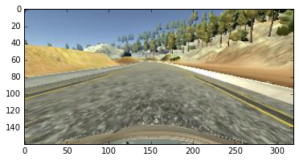
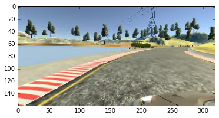
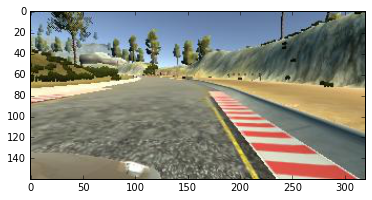
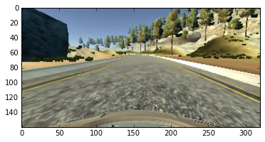
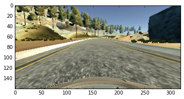

# CarND-Behavioral-Cloning
#**Behavioral Cloning** 

---

**Behavioral Cloning Project**

The goals/steps of this project are the following:
* Use the Udacity simulator to collect data of good driving behavior
* Build a convolution neural network in Keras that predicts steering angles from images
* Train and validate the model with training and validation sets
* Test that the model successfully drives around track without leaving the road
* Summarize the results


[//]: # (Image References)

[image1]: ./examples/placeholder.png "Model Visualization"
[image2]: ./examples/placeholder.png "Grayscaling"
[image3]: ./examples/placeholder_small.png "Recovery Image"
[image4]: ./examples/placeholder_small.png "Recovery Image"
[image5]: ./examples/placeholder_small.png "Recovery Image"
[image6]: ./examples/placeholder_small.png "Normal Image"
[image7]: ./examples/placeholder_small.png "Flipped Image"

####1. Files required to run the simulator in autonomous mode

My project includes the following files:
* model.py containing the script to create and train the model
* drive.py for driving the car in autonomous mode
* model.h5 containing a trained convolution neural network 
* writeup_report.md or writeup_report.pdf summarizing the results

####2. Submission includes functional code
Using the Udacity provided simulator and my drive.py file, the car can be driven autonomously around the track by executing 
```sh
python drive.py model.h5
```

The model.py file contains the code for training and saving the convolution neural network. The file shows the pipeline I used for training and validating the model, and it contains comments to explain how the code works.

###Model Architecture and Training Strategy

####1. An appropriate model architecture has been employed

My model consists of a convolution neural network with 5x5 filter sizes and depths between 32 and 128  
The architecture of my model is as follows (model.py lines 47-54):
* A convolutional layer with 6 5X5 filters and a ReLU activation function
* A Max pooling layer of size 2X2
* A convolutional layer with 6 5X5 filters and a ReLU activation function
* A Max pooling layer of size 2X2
* A dense layer with 120 neurons and a ReLU activation function
* A dense layer with 84 neurons and a ReLU activation function
* An ourput layer

The model includes RELU layers to introduce nonlinearity, and the data is normalized in the model using a Keras lambda layer (code line 45). 

####2. Attempts to reduce overfitting in the model

The model was trained and validated on different data sets to ensure that the model was not overfitting (code line 75). The model was tested by running it through the simulator and ensuring that the vehicle could stay on the track.

####3. Model parameter tuning

The model used an adam optimizer, so the learning rate was not tuned manually (model.py line 56).

####4. Appropriate training data

Training data was chosen to keep the vehicle driving on the road. I used a combination of center lane driving, recovering from the left and right sides of the road, and augmentation by flipping the images horizontally. 

For details about how I created the training data, see the next section. 

###Model Architecture and Training Strategy

####1. Solution Design Approach

The overall strategy for deriving a model architecture was to increase its generalization performance by optimizing its performance on training and validation data. 

My first step was to use a neural network with one hidden (dense) layer of 80 neurons to get a feel of how a very simple model perform on this data.

In order to gauge how well the model was working, I split my image and steering angle data into a training (80%) and validation set (20%). I found that my first model had a high mean squared error on the training set and a high mean squared error on the validation set. This implied that the model was underfitted. 

To combat the underfitting, I modified the model so that it has enough capacity to absorb the training data without overfitting it.

Then I retrained and validated it the model on random 80 & 20% parts of the original data.  

The final step was to run the simulator to see how well the car was driving around track one. There was only one spot where the vehicle almost touched the left mark of the lane, but it came back to the center of the lane. 

####2. Final Model Architecture

The final architecture is to use a convolution neural network model similar to LeNet. I thought this model might be appropriate because it can handle visual data well.


####3. Creation of the Training Set & Training Process

To capture good driving behavior, I first recorded two laps on track one using center lane driving. Here is an example image of center lane driving:

<p align="center">  </p>

I then recorded the vehicle recovering from the left side and right sides of the road back to center so that the vehicle would learn to stay in the center of the lane in curved roads. These images show what a recovery looks like:

<p align="center">  </p>
<p align="center">  </p>

To augment the data sat, I also flipped images and angles thinking that this would remove the bias due to the curves are always to one side (e.g., right). For example, here is an image that has then been flipped:

<p align="center">  </p>
<p align="center">  </p>

In addition to the images from the center camera, I also used the images from the left and right cameras to augment the data. I corrected the steering angle with a correction factor of -0.2 and 0.2 for left and right perspectives, respectively. 

After the collection process, I had 32144 data points. I then preprocessed this data by cropping the top 75 and bottom 25 pixels to remove the background artifacts such as trees and the hood of the car.


I finally randomly shuffled the data set and put 20% of the data into a validation set. 

I used this training data for training the model. The validation set helped determine if the model was over or under fitting. The ideal number of epochs was 7 which gave the lowest validation loss for the data I have. I used an adam optimizer so that manually training the learning rate wasn't necessary.
